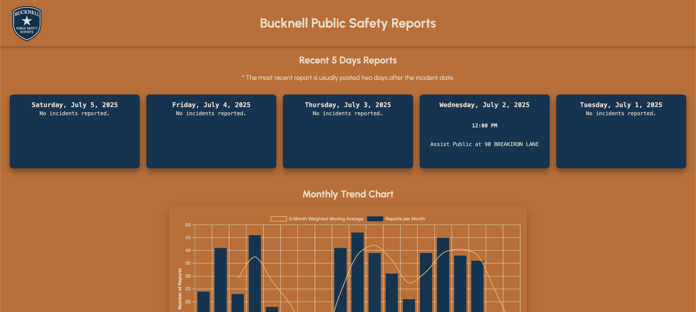

# Bucknell Public Safety Reports

An independently maintained project that scrapes, parses, and visualizes crime log data published by Bucknell University Public Safety. The goal is to make recent reports more accessible and easier to understand through an interactive web interface.



## 🔍 Features

- Automated scraping of PDF crime logs from Bucknell’s website
- Extraction and formatting of report data into structured JSON
- Dynamic, interactive website built with Flask and Chart.js
- Daily updates with GitHub Actions
- Responsive design and modern UI
- Historical trend graph with weighted moving averages
- Displays last 5 available daily reports

## 🚀 Live Site

🌐 [parkerrjackson.com](https://parkerrjackson.com) 

*may take a minute for Render to initialize*

---

## 📁 Folder Structure

```
.
├── app.py                  # Flask application
├── api/stats/monthly       # Calculated stats
├── debug_reports.py        # Scraper and parser logic (with table printout)
├── get_reports.py          # Main scraper and parser logic
├── reports/                # JSON files for each parsed day
├── static/
│   ├── script.js           # Frontend JavaScript
│   ├── styles.css          # Custom styles
│   ├── preview.png         # Preview image
│   └── favicon.ico         # Site icon
├── templates/
│   ├── render.yaml         # Render script
│   └── index.html          # Main HTML template
├── .github/workflows/      # GitHub Actions logic
├── old
├── requirements.txt
└── README.md
```

---

## 🧠 How It Works

1. **Scraping**: The `main.py` script downloads crime log PDFs, extracts text using `PyMuPDF`, and parses them with GPT-4 to structured JSON.
2. **Frontend**: The `script.js` file handles dynamic loading of reports, displaying recent reports, and generating charts.
3. **Backend**: A lightweight Flask app serves reports and stats via `/reports/` and `/api/` endpoints.

---

## 📅 Automation

### GitHub Actions

This project supports daily scraping and Git commit via a GitHub Actions workflow:

- `.github/workflows/update_reports.yml`

---

## 📌 Disclaimer

This project is **not affiliated with Bucknell University**. It is built and maintained independently to improve transparency and accessibility of public safety data.

---

## 👤 Author

[Parker Jackson](https://github.com/prjackson17)

📬 Contact: prjackson17@gmail.com

📍 Student at Bucknell University
